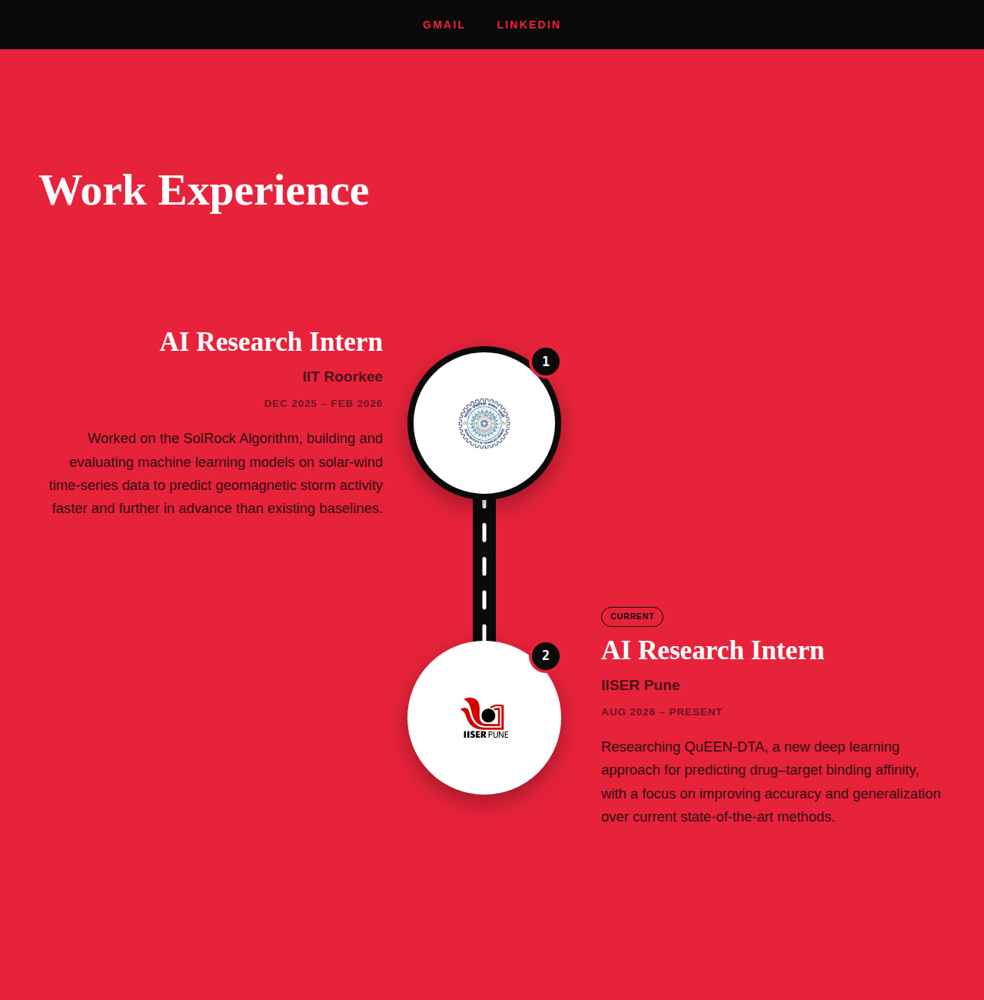
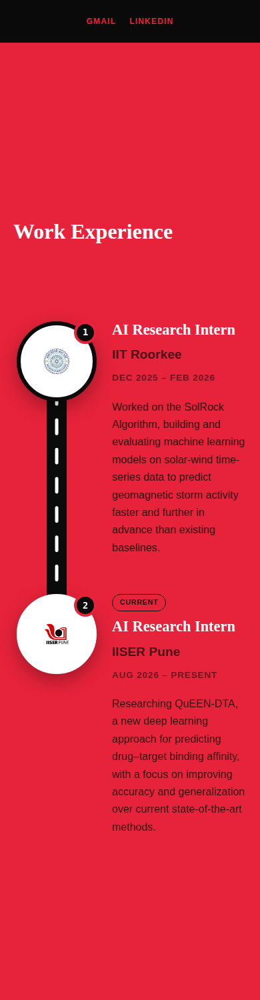

# Vrushal More — Portfolio

Personal portfolio site for Vrushal More — AI Engineer & Software Engineer.
Built with plain HTML, CSS, and JavaScript (no framework, no build step).

**Live site:** [add your deployed URL here]

## Screenshots

| Desktop | Mobile |
|---|---|
|  |  |

## Tech stack

- HTML5
- CSS3 (custom properties, no framework)
- Vanilla JavaScript

## Project structure

```
.
├── index.html              # Main page
├── assets/
│   ├── css/style.css       # Styles
│   ├── js/script.js        # Scripts (nav, sliders, project/award rendering)
│   ├── images/             # Logos, project thumbnails, photos
│   └── data/content.json   # Optional structured content (experience/projects/awards)
├── docs/
│   └── screenshots/        # Preview images used in this README
├── LICENSE
└── README.md
```

## Running locally

No build tools required — just serve the folder statically, e.g.:

```bash
python3 -m http.server 8000
# then open http://localhost:8000
```

## License

MIT — see [LICENSE](LICENSE).
